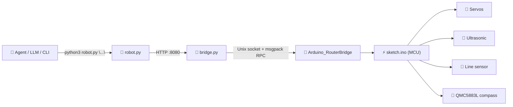

# 🤖 Jaime — Autonomous Arduino UNO Q Robot

**An AI Agentic robot built on the Arduino UNO Q.**

---

## ✨ Features

- 🛞 **Differential drive** — timed forward / back / left / right movement
- 📏 **Ultrasonic distance sensing** — drive until an obstacle is N cm away
- 🎨 **Floor line detection** — drive until the Nth line is crossed, with early wall-abort
- 🧭 **Compass-corrected heading control** — small-pulse turns that verify against a real
  magnetometer reading instead of guessing timing
- 🗣️ **Natural-language command layer** (`"park in the first available spot"`, `"inspect occupancy percentage"`, …) 
- 🅿️ **Example agent skill** (`PARKING.md`) showing the whole stack driving a parking-garage
  scenario end to end

---

## 🏗️ Architecture



The Arduino UNO Q pairs an MPU (Linux side) with an MCU (real-time side). `sketch.ino` runs on
the MCU and owns the hardware; `bridge.py` runs on the MPU and translates plain HTTP requests
into the MCU's RPC protocol; `robot.py` is the client — usable as a Python library, a CLI, or a
natural-language command handler for an agent.

---

## 📁 Repository Structure

```text
.
├── sketch.ino     # MCU firmware: motors, sensors, compass, calibration
├── bridge.py      # HTTP ↔ MCU bridge, runs on the board's Linux side
├── robot.py       # Python client + CLI + natural-language command handler
└── PARKING.md     # Example agent "skill" — an autonomous parking garage task
```

---

## 🚀 Getting Started

### 1. Flash the firmware

Open `sketch.ino` in the Arduino IDE (UNO Q board support installed) and upload it.
On boot, watch the Serial monitor (115200 baud) — the compass runs its one-time hard/soft-iron
calibration automatically:

```
=== Compass calibration ===
Turn the robot in place for about 3 full slow spins now.
(runs for up to 25 seconds)
  t=1000 ms  balance=42%  radius=0.18
  ...
Calibration converged.
  heading now: 183.3  (X=-0.48 Y=-0.03 Z=0.26)
```

### 2. Start the bridge

On the board itself:

```bash
nohup python3 bridge.py > bridge.log 2>&1 &
```

You should see:

```
[12:00:00.000] Starting bridge...
[12:00:00.010] Connected to /var/run/arduino-router.sock
[12:00:00.015] HTTP API listening on port 8080
[12:00:00.015] Jaime robot bridge running
```

### 3. Capture the robot's reference headings

Point the robot at "front," then "left," then "right," confirming each with Enter:

```bash
python3 robot.py "setup"
```

### 4. Manual test

```bash
python3 robot.py "read sensors"
python3 robot.py "move forward 2 seconds"
python3 robot.py "rotate right 0.4 seconds"
python3 robot.py "heading right"
```

Then use OpenClaw. Example: park in the first available spot.

---

## 📋 Command Reference for AI Agentic

| Command | Description |
|---|---|
| `setup` | Interactively captures front / left / right reference headings |
| `read sensors` | Returns distance (cm), line sensor value, and compass heading |
| `move forward N seconds` | Drive forward for N seconds |
| `move back N seconds` | Drive backward for N seconds |
| `rotate right N seconds` | Timed turn right, no compass correction |
| `rotate left N seconds` | Timed turn left, no compass correction |
| `heading front` | Compass-corrected turn to the stored front heading |
| `heading left` | Compass-corrected turn to the stored left heading |
| `heading right` | Compass-corrected turn to the stored right heading |
| `forward until N` | Drive forward until distance ≤ N cm |
| `forward until line N` | Drive forward until the Nth line (aborts early on a wall) |
| `back until line N` | Drive backward until the Nth line |
| `stop` | Immediately stop |

💡 **Turning tip:** for a reliable 90° turn, chain a fast timed rotation with a compass
correction:

```bash
python3 robot.py "rotate right 0.4 seconds"
python3 robot.py "heading right"
```

---

## 🅿️ Building an Agent Skill

`PARKING.md` is a ready-to-use example: a full agent "skill" describing a parking-garage
scenario, the two-step turning procedure above, and how an LLM agent should plan and execute
sequences of `robot.py` commands to park and exit autonomously. Use it as a template for
building other Jaime-powered skills.

---

## 🛠️ Hardware

| Component | Notes |
|---|---|
| Arduino UNO Q | MPU + MCU combo board |
| 2× continuous-rotation servo | Differential drive, left/right |
| Ultrasonic distance sensor | Analog output |
| Analog line sensor | ~950–1023 reading = on a black line |
| QMC5883L magnetometer | Marked "HMC" on some boards — it's a QMC5883L |

## 📄 Demo

https://www.youtube.com/shorts/6l1wQNMgGkE
https://youtu.be/_GZKD7dg9gM

---

## Full tutorial

https://projecthub.arduino.cc/ronibandini/jaime-bb8a4a

---
## 📄 License

MIT License — see source file headers.

## 👤 Author

**Roni Bandini** — July 2026
